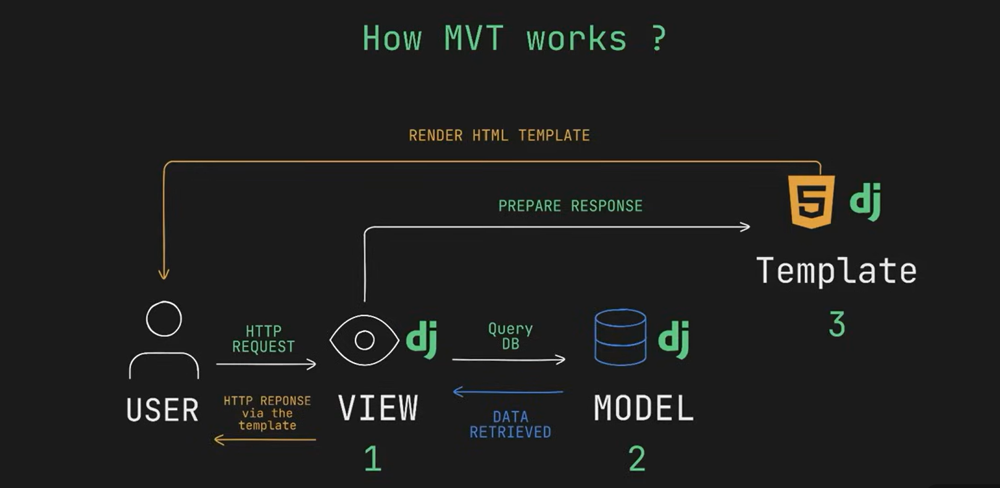

# Django Web Framework
## Lesson1: Introduction
- You need to know python, HTML, CSS
- **Django**: is a python based web framework designed for rapid development of efficient web applications.
### Importance of Django?
- Rapid development
- Database flexibility
- Built-in admin interface
- Extensive ecosystem
- It follows the Model-View-Template(MVT) architecture.
### Components of the MVT architecture
1. Model: this is the Data structure of your application, it is your DB essentially.
2. View: This is a python function/class that receives http requests and returns http responses.
3. Template: they are html files that contain the structure of your application, UI essentially.
### How MVT works

User interacts with the django application by sending http request to specific urls. The request can be for: viewing a page, submitting a form or performing some other operations.
The view function/class processes the request, interacts with the DB and prepares data to be rendered in the response.
When the view interacts with the model to fetch data from the DB, it does so by using django's ORM(Object Relational Mapping).
ORM allows you to simply interact the DB using python objects, so instead of writing SQL queries directly you define your DB structure using the python classes called models.
Models represent DB tables and each attribute corresponds to a column in that table.
The interaction btn the view and model can be for data retrieving, creating,updating or deleting records as needed.
After processing the request and interacting with the DB, the view prepares data to be rendered in a response.
The data is typically passed through a template using django template language.
Django template language uses template tags and placeholders to dynamically generate HTML content.
Finally, the view returns an HTTP response containing the html content generated by the template.
The response is sent back to the user's browser which then renders the page and displays it to the user.

## Lesson 2: Setup & Installation
- Install Python and Django
Install django on windows: **python -m pip install Django==6.0.3**
install pipenv on your django projects folder: **pip install pipenv**
Confirm if django is installed in your project: **pip freeze**

### Create Your 1st Project
create: **django-admin startproject myproject**

## Lesson 3: Django Basics
- creating django app
* **Activate Venv:**
- command; pipenv shell
- With this it is easy to install any 3rd party libraries inside your project wothout worry of dependency mix up in the global file system.
- it creates a pipfile in your project folder, it keeps all your configurations(dependecies,packages).
- pip file should never be edited.
* **Install Django in your venv:**
- command; pipenv install django
- it creates the pipfile.lock 
* **Create your project**
- syntax: django-admin startproject projectname
- e.g: django-admin startproject worldtour
- you can create more than 1 app in your project
- it creates the manage.py 
- manage.py should not be altered, it helps in creating your applications
* **Start creating your app:**
- cd worldtour - to move to your project folder
- create app: 
- syntax: python manage.py startapp appname
- e.g: python manage.py startapp asiatoursagency
- The app folder will handle all the operations.
- The app comes with different files:
1. __init__.py: it treats a directory as a package. It is used to import app modules elsewhere in your django project.
2. admin.py: used to register your app models with django's admin panel. This provides a user-fiendly interface to interact with the date model directly from admin interface.
3. apps.py: it contains configuration class for your application. The config class stores each application's specific settings in that file.
4. models.py: this is one of the most important files. You define your data models here. Basically each class in this file represents a DB table and the class attributes represent the DB fields. This is where we create our DB
5. test.py: is used for writing unit tests for your app functionalities
6. views.py: it handles the request response logic for your application. You can define your functions/classes here and the functions will receive web requests and return web responses. They access the data needed to satisfy the requests via the models.py and delegate formatting to the templates; **VMT(ViewModelTemplate)**
- Migrations folder: it contains migration files for your application. They are simply how django stores changes to your models, hence your DB schema. Each migration file is time stamped and contains details about the changes being made to the DB.
### Apps.py file
- It is very important because we need to link inside our project in settings.py we need to add our application name.
* 2 ways of storing our application name:
             * In settings.py: Add it in the installed apps list: 'asiatoursagency' OR 'asiatoursagency.apps.AsiatoursagencyConfig'(this tells django that your application is inside the installed apps already)
             * In apps.py: access the appname config class
- In views.py import HTTP Response function: so when a client sends an HTTP request to the server, the servers sends an HTTP response and when a client receives the response, the page is going to be rendered.
- Handle url routing for it is essentia. 
- We have a main urls.py for the main project, but we need to manually create a urls.py file in the application level
- in main urls.py includes the admin path: will help us explore the admin dashboard, add you application url too (this autogenarates the db.sqlite3)

## Lesson 4: Database Setup
- create a new folder: **mkdir lesson3**
- enable venv: **pipenv shell**
- install django: **pipenv install django**
- create the project: **django-admin startproject worldtour**
- move to your project folder: **cd worldtour**
- create the application: **python manage.py startapp asiatoursagency**
- move to models.py in your application and create the models
    * Django's ORM(Object Relational Mapping)- It takes care of all CRUDE(Create, Read, Update, DELETE) operations on a table.
- Migrations:they are django's way of propagating changes we make to our models
- Make sure in your settings.py in installed apps your app is listed
-Apply migrations in your project folder: **python manage.py makemigrations**; this creates the 0001_initial.py
- apply the migrations: **python manage.py migrate**; all pending migrations are made.

## Lesson 5: Adding Database Records
* Launch interactive python:
         *in windows: ipython or python manage.py shell
         * in linux: ipython3 or python manage.py shell
- Import Tour class from the models.py: **from asiatoursagency.models import Tour**
- Instantiate from Tour class, a tour object: e.g. to1 = Tour(origin_country="Japan", destination_country="China", number_of_nights=10, price=1500)
- Access attributes of to1: e.g. **to1.origin_country**
- to get a better string representation of to1: enter the str method in the tour class in models.py of the application
- str function brings a nice string representation of whatever want to display
- save to1 to the DB: **to1.save()**
- access to1: **to1**
* Exit python: CTRL+D, then type Y

## Displaying Records
* Rendering HTML Template
